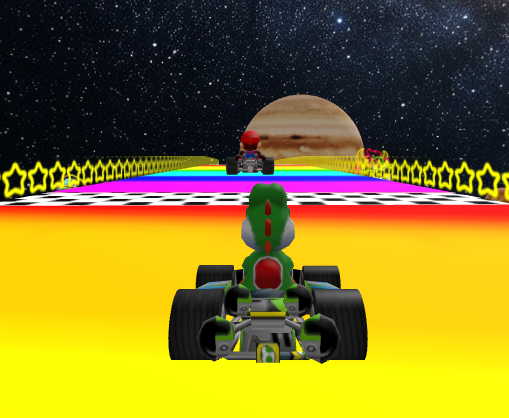

# 🏁 Rainbow Road


## 🌈 What it is



**Rainbow Road** is a browser-based 3D racing game built with [A-Frame](https://aframe.io/), recreating the iconic Rainbow Road track from *Mario Kart*. You take the wheel in first person and race a full lap around a floating circuit suspended in space, while a ghost kart competes against you for the finish line. The first to complete the lap wins, and the result is announced on screen with the winning kart lit up and the loser dimmed to grayscale. The ghost kart is just a recorded lap of mine, so try to beat me!

The whole scene is set against an animated solar system: the Sun, the planets, and the Moon orbit and spin continuously in the background while a soundtrack loops throughout the race.

Under the hood, the game relies on a handful of custom A-Frame components:

- **`snap-to-mesh`**: casts a downward ray to keep each kart glued to the surface of the track, even as the circuit is scaled and rotated.
- **`lock-pitch`**: clamps the camera's vertical look angle so the player keeps their eyes on the road.
- **`waypoint-follower`**: drives the ghost kart along all the points I recorded while driving the lap myself.
- **`race-manager`**: tracks laps, detects when a kart crosses the finish line, decides the winner, and applies the win/lose visual effects.

> [!TIP]
> A-Frame requires the page to be served over HTTP.
> The [Live Preview](https://marketplace.visualstudio.com/items?itemName=ms-vscode.live-server)
> extension for VS Code is a quick way to launch a local server with live reload.


## 🗂️ Project structure

```
├── index.html             # Main scene + custom A-Frame components
├── Assets/                # A-Frame objects
└── Images/                # README screenshots
```

## ⌨️ Controls

<div align="center">

| Key | Action |
|-----|--------|
| `W` / `↑` | Accelerate forward |
| `S` / `↓` | Reverse |
| `A` / `←` | Strafe left |
| `D` / `→` | Strafe right |
| Mouse | Look around (vertical angle limited) |

</div>

## 📄 License

This project is licensed under the [MIT License](LICENSE).

The MIT License is a permissive license that is short and to the point. It allows for broad use, modification, and distribution of the software.

| Permissions | Conditions | Limitations |
|---|---|---|
| ✅ Commercial use | ℹ️ License and copyright notice | ❌ Liability |
| ✅ Modification |  | ❌ Warranty |
| ✅ Distribution |  |  |
| ✅ Private use |  |  |

Key Terms
 * Rights: You can do almost anything with the code, including using it in proprietary software.
 * Requirement: You must include the original copyright notice and the license text in any copy of the software.
 * No Warranty: The software is provided "as is", and the authors cannot be held liable for any issues arising from its use.